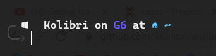

# ansible-playbooks


## Terminal Preview


## Installing Ansible 
### Requirements
- A system with Python 2.7 or 3.5+ installed
- A terminal or command prompt access

### Installation on Ubuntu or Debian
1. Update the package list: 
    ```bash
    sudo apt-get update
    ```
2. Install the software-properties-common package, which is used to manage PPAs: 
    ```bash
    sudo apt-get install software-properties-common
    ```
3. Add the Ansible PPA: 
    ```bash
    sudo apt-add-repository --yes --update ppa:ansible/ansible
    ```
4. Install Ansible: 
    ```bash
    sudo apt-get install ansible
    ```

### Installation on CentOS or Fedora
1. Install EPEL repository: 
    ```bash
    sudo yum install epel-release
    ```
2. Install Ansible: 
    ```bash
    sudo yum install ansible
    ```

### Verifying the installation
To check if Ansible is installed and check the version, use the following command:
```bash
ansible --version
```

## How to run

- NOTE playbook is configured for Debian based remotes specifically Ubuntu 20.04 LXC

Clone Repo 
```bash
git clone https://github.com/RKolibri/ansible-playbooks.git 
```
Change `dir`  into that directory
```bash
cd ansible-playbooks
```

* Edit `inventory` to your liking
* Remember to change ``variable`` for `username` and change the  `password` field on the  `/playbooks/main.yml`

Then run

```bash
ansible-playbook playbooks/main.yml -i inventory
```
# Documentation

This playbook will update packages, create a new user, add the user to the sudoers file, add an ssh key to the authorized keys for the new user, install and configure [Starship](https://starship.rs/) for the new user, clone a dotfiles repository, and disable password authentication for ssh.

## Variables
- `user`: The username for the user you want to create. This variable should be set before running the playbook.

## Tasks

1. Update packages: This task updates the package cache and upgrades all packages to the latest version.
2. Install curl and git: This task installs the curl and git packages.
3. Create user: This task creates a new user with the specified username and password. The user's shell is set to /bin/bash and the password is hashed using the sha512 algorithm.
4. Add user to sudoers: This task adds the new user to the sudoers file, allowing them to run commands with superuser privileges without entering a password.
5. Add ssh key to authorized keys: This task adds the ssh key located at `/root/.ssh/id_rsa.pub` to the authorized keys for the new user.
6. Install Starship: This task installs and configures the Starship shell prompt for the new user.
7. Add Starship to .bashrc: This task adds the Starship configuration to the .bashrc file for the new user.
8. Clone dotfiles repo: This task clones a repository containing dotfiles to the new user's home directory.
9. Create a directory if it does not exist: This task creates a directory for starship.toml configuration if it does not exist.
10. Copy files from source to destination: This task copies the starship.toml file from the cloned repository to the directory created in the previous task.
11. Disable password authentication: This task modifies the ssh configuration to disable password authentication for ssh.
